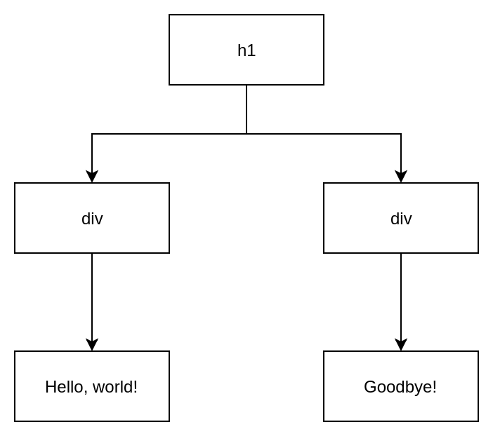

import { Notes } from 'mdx-deck'
import { Invert, SplitRight, Split, FullScreenCode } from 'mdx-deck/layouts'
export {combinedThemes as themes} from 'theme'


# Welcome to React quick start!

---

## Overview

<Notes>
Developed by Facebook, initially release May 2013

Framework for building user interfaces

Organized as a tree of components (more on this later)

Create reusable, single-purpose components

Easy to test

Handles data binding

Handles listeners

Most importantly, handles DOM updates in the quickest way possible
</Notes>

---

### create-react-app

```bash
.
├── node_modules
├── package.json
├── public
└── src
```

<Notes>
create-react-app is a utility for bootstrapping a new react project and creates
most of the boilerplate you need to get going.

node_modules for vendored dependencies

package.json for build scripts, dependency listings, project info

public for static assets and index.html

src for javascript
</Notes>

---

### index.html

```html
<!DOCTYPE html>
<html lang="en">
  <head>
    <meta charset="utf-8" />
    <link rel="shortcut icon" href="%PUBLIC_URL%/favicon.ico" />
    <meta
      name="viewport"
      content="width=device-width, initial-scale=1, shrink-to-fit=no"
    />
    <meta name="theme-color" content="#000000" />
    <link rel="manifest" href="%PUBLIC_URL%/manifest.json" />
    <title>React App</title>
  </head>
  <body>
    <noscript>You need to enable JavaScript to run this app.</noscript>
    <div id="root"></div>
  </body>
</html>
```

<Notes>
contains some boilerplate html and a single element under the body with id root

this is where our react application gets mounted
</Notes>

---

### index.js

```js
import React from "react"
import ReactDOM from "react-dom"

ReactDOM.render(<h1>Hello, world!</h1>, document.getElementById("root"))
```

<Notes>
The call to ReactDOM.render mounts the application and takes an element and a
mount point. You can see the root id again here.

The h1 looks like html, but is actually JSX
</Notes>

---

## JSX

<Notes>
Javascript XML extension to JS syntax, compiled to JS

Other frameworks use things like directives, properties on html elements, but
JSX lets us write javascript directly in our templates and vice versa
</Notes>

---

### Under the hood

```js
React.createElement("h1", null, "Hello, world!");
```

<Notes>
JSX elements get compiled to javascript calls that create VDOM elements. We'll
see an example of the virtual DOM in action later, but it's basically a secondary
representation of the DOM that React uses to calculate updates so that the fewest
elements possible get rerendered.

Takes type, arguments(props) and children

Used to be written entirely this way
</Notes>

---

### Under the hood

```jsx
<h1 type="notice">
  <div>Hello, world!</div>
  <div>Goodbye!</div>
</h1>
```

becomes:

```js
React.createElement(
  "h1",
  {
    type: "notice"
  },
  React.createElement("div", null, "Hello, world!"),
  React.createElement("div", null, "Goodbye!")
);
```

<Notes>
Here we see both props and children being passed in, we'll see more of props in
a bit, but as we can see with the transpiled version, they're basically arguments
to createElement
</Notes>

---

### Component Tree



<Notes>
The elements from the previous slide become this component tree

Important: changes to one div *don't* rerender the other (VDOM in action)
</Notes>

---

## Components

<Notes>
The primary building block of React interfaces. Either

A class with a render method that returns JSX
A function that returns JSX

more on the differences later, but basically it's something that can be rendered
(though this might not always be visually)
</Notes>

---

import {UselessCounter} from './components/Counter'

### The basics

```jsx
class UselessCounter extends Component {
  render() {
    return (
      <div>
        <div>0</div>
        <button>-</button>
        <button>+</button>
      </div>
    )
  }
}
```

<UselessCounter />


<Notes>
This is a basic class component, it extends the React Component class to get all
the lifecycle methods, etc.

It has a render method that returns some JSX (remember this is still not HTML)
</Notes>

---

import {StatefulCounter} from './components/Counter'

### State

```jsx
class StatefulCounter extends Component {
  state = {
    count: 0
  }
  render() {
    const { count } = this.state
    return (
      <div>
        <div>{count}</div>
        <button>-</button>
        <button>+</button>
      </div>
    )
  }
}
```

<StatefulCounter />

<Notes>
State is any information that needs to be stored in your application.

State exists in a lot of different forms, but the first one you'll
probably see is local state.

Application state is data, logged in user, a list of vehicles, etc.

UI state is things like IsModalOpen, IsDisabled, etc.
</Notes>

---

import {Counter} from './components/Counter'

### Events

```jsx
class Counter extends Component {
  state = {
    count: 0
  }
  render() {
    const { count } = this.state
    return (
      <div>
        <div>{count}</div>
        <button onClick={() => this.setState({ count: count - 1 })}>-</button>
        <button onClick={() => this.setState({ count: count + 1 })}>+</button>
      </div>
    )
  }
}
```

<Counter />

<Notes>
State is useful when we can modify it

The buttons take a function to run when clicked, setState updates the state to
the new value

Why not just change count directly?

Safety and performance. Changing state rerenders, so setState batches state
updates. If multiple places change state simultaneously, what happens? setState
applies state updates in order so last write wins.
</Notes>

---

import {PropsCounter} from './components/Counter'

### Props

```jsx
class PropsCounter extends Component {
  state = {
    count: 0
  }
  render() {
    const { count } = this.state
    const { step } = this.props
    return (
      <div>
        <div>{count}</div>
        <button onClick={() => this.setState({ count: count - step })}>
          -
        </button>
        <button onClick={() => this.setState({ count: count + step })}>
          +
        </button>
      </div>
    )
  }
}
```

<Notes>
Remember, props are arguments to createElement. Get passed to the component.

Change behavior of a component from a parent.
</Notes>

---

### Example

```jsx
<PropsCounter step={1}/>
<PropsCounter step={2}/>
<PropsCounter step={20}/>
```

<div style={{ display: "flex", justifyContent: "space-between" }}>
  <div>
    <h4>step=1</h4>
    <PropsCounter step={1}/>
  </div>
  <div style={{marginLeft: "20px", marginRight: "20px"}}>
    <h4>step=2</h4>
    <PropsCounter step={2}/>
  </div>
  <div>
    <h4>step=20</h4>
    <PropsCounter step={20}/>
  </div>
</div>

---

import { RainbowCounter } from './components/Counter'

### Virtual DOM

<RainbowCounter step={1}/>
<RainbowCounter step={2}/>
<RainbowCounter step={20}/>

<Notes>
Virtual DOM at work

Each counter changes background when render is called for that component

Virtual DOM ensures that only the counter whose state changed rerenders
</Notes>

---

## Lifecycle Methods

<Notes>
UI elements are rendered immediately. Lifecycle methods let us tap in at various
points of the rendering/rerendering process to change behavior, etc.

The current way of handling this is using class based components because they
come with standard lifecycle methods provided by React.
</Notes>

---

### Current

```
class MyComponent extends React.Component {
  constructor() {
    // Not generally used unless you need to initialize state or bind methods
  }
  render() {
    // Returns the actual JSX to render
  }
  componentDidMount() {
    // Do some work to get data, compute properties, etc.
  }
  componentDidUpdate() {
    // Useful for skipping renders based on props, but have to be careful
  }
  componentWillUnmount() {
    // Clean up event listeners, connections, timers, etc.
  }
```

<Notes>
Constructor can be used to initialize state, but that's usually done as a static
property now, and binding methods can be avoided with use of arrow functions, so
not seen much at all in new projects

render we've seen before

componentDidMount is called only after the component is mounted into the DOM.
At that point it is safe to do async work and state updates, etc.

componentDidUpdate can be used for some components that need to modify how often
they rerender, but it's difficult to get this right so avoid it unless there is
no other way.

componentWillUnmount gives us away to clean up things like listeners so that we
don't end up with memory leaks.
</Notes>

---

### Lifecycle Methods: Example

```jsx
class Inventory extends React.Component {
  state = {
    loading: true,
    error: null,
    vehicles: []
  }
  async componentDidMount() {
    try {
      const vehicles = await vehicleService.List()
      this.setState({ loading: false, vehicles })
    } catch (error) {
      this.setState({ loading: false, error })
    }
  }
  render() {
    const { loading, error, vehicle } = this.state
    if (loading) return <div>Loading...</div>
    if (error) return <div>Error getting vehicles: {error}</div>
    return (
      <VehicleList vehicles={vehicles} />
    )
  }
}
```

<Notes>
This is a fairly standard pattern for loading data from a remote API and then
rendering once it has been received.

We also see that this component doesn't actually specify how to render and just
passes the data to another component. This isn't the best way of doing that, but
separating presentational components and container components is a best practice.
</Notes>

---

### Future

Hooks (more on this later)

---

## Functional Stateless Components

<Notes>
Functions that return JSX

They don't have state*

They don't have lifecycle methods*

Why then? Easy to test. Fast.
</Notes>

---

import {Button} from './components/Button'

### Functional Stateless Components: Example

```jsx
const Button = ({title, handleOnClick}) => (
  <button onClick={handleOnClick}>{title}</button>
)
```

How do you use one?

```jsx
<Button title="Click Me" handleOnClick={() => alert("hello")} />
<Button title="Don't Click Me" />
```

<Button title="Click Me" handleOnClick={() => alert("hello")} />
<br />
<Button title="Don't Click Me" />

<Notes>
They take props like class components, but they receive them as arguments since
there is no this for a function.
</Notes>

---

import { CounterWithButtons } from './components/Counter'

### Better Example

<CounterWithButtons />

<Notes>
Our good friend the counter. Looks exactly the same, but underneath...
</Notes>

---

### Better Example

```jsx
class CounterWithButtons extends Component {
  state = {
    count: 0
  }
  render() {
    const { count } = this.state
    return (
      <div>
        <div>{count}</div>
        <Button
          title="-"
          handleOnClick={() => this.setState({ count: count - 1 })}
        />
        <Button
          title="+"
          handleOnClick={() => this.setState({ count: count + 1 })}
        />
      </div>
    )
  }
}
```

<Notes>
We're using our new button component. The button itself doesn't care what the
title is or what happens when you click it, only that it displays what it gets
and does what its told (and those become your tests).

Simple example, but imagine Button was actually very complex and handled all
kinds of other things behind the scenes...like styling.
</Notes>

---

### Aside: CSS In JS

```jsx
const ButtonStyles = styled.button`
  background: #ffd600;
  font-size: 28px;
  font-weight: bold;
  padding: 10px 20px;
  margin: 5px;
  border: none;
  outline: none;
  :hover {
    box-shadow: 0 2px 8px #21212133;
    cursor: pointer;
  }
  :active {
    box-shadow: 0 1px 3px #21212133;
  }
`

const StyledButton = ({ title, handleOnClick }) => (
  <ButtonStyles onClick={handleOnClick}>{title}</ButtonStyles>
)
```

<Notes>
You can style react apps like you style anything else with a big ole CSS file
and BEM and all that stuff.

React lets you add styles in your components directly and they become inline
styles (no more !important), but it gets kind of unwieldy and it's not *quite*
CSS.

Popular options:

Styled components/emotion/glamour/etc.
CSS Modules

Modules let you reuse the same css identifiers without conflicts in different
stylesheets.

Styled components let you wrap existing components using a special syntax and
then use those the same way you would a regular react component. Mostly personal
preference, but both have some tradeoffs.
</Notes>

---

### Better Example: With Style

```jsx
class CounterWithPrettyButtons extends Component {
  state = {
    count: 0
  }
  render() {
    const { count } = this.state
    return (
      <div>
        <div>{count}</div>
        <StyledButton
          title="-"
          handleOnClick={() => this.setState({ count: count - 1 })}
        />
        <StyledButton
          title="+"
          handleOnClick={() => this.setState({ count: count + 1 })}
        />
      </div>
    )
  }
}
```

<Notes>
Can now use styled button anywhere we need a button and get consistent design.

Build your design system in react.
</Notes>

---

import { CounterWithPrettyButtons } from './components/Counter'

### 🎉 Ooh Aaaah 🎉

<CounterWithPrettyButtons />

---

## Hooks

<Notes>
(Very) new feature. Address some shortcomings of previous syntax and add a lot
more utility to SFCs.

Purpose built functions for handling things like effects, state, context, etc.

Weren't in React mainline when sidekick written, will be in frazer web.
</Notes>

---

import { SelfAwareButton } from './components/Button'

### useState

```jsx
const SelfAwareButton = () => {
  const [clicked, setClicked] = useState(0)
  const title = "Clicked " + clicked + "times."
  return (
    <StyledButton
      handleOnClick={() => setClicked(clicked + 1)}
      title={title}
    />
  )
}
```

<SelfAwareButton />

<Notes>
Remember functions can't have state because they don't have properties. useState
lets you declare a piece of state that gets persisted between calls. Returns
the current state and a setter (like setState). Boom. State in your SFC.
</Notes>

---

### useEffect

```jsx
useEffect(() => {
  window.addEventListener('keydown', downHandler);
  window.addEventListener('keyup', upHandler);
  // Remove event listeners on cleanup
  return () => {
    window.removeEventListener('keydown', downHandler);
    window.removeEventListener('keyup', upHandler);
  };
}, []);
```

<Notes>
useEffect is a little harder to demonstrate and understand, but basically it
lets you perform actions with side effects on mount *and* update (replaces two
class lifecycle methods).

The return value is a cleanup function that gets called on unmount (replaces yet
another lifecycle method).

Second argument is an array of properties that have to change to call useeffect
again to prevent it calling more than once (empty array means don't rerun it).
</Notes>

---

import App from './components/Context'

### useContext

```jsx
const LoggedInContext = React.createContext()

const App = () => {
  const [loggedIn, setLoggedIn] = useState(false)
  return (
    <LoggedInContext.Provider value={loggedIn}>
      <Toggle isLoggedIn={loggedIn} onToggle={() => setLoggedIn(!loggedIn)} />
      <div>I'm available to everyone</div>
      <SecureDiv />
    </LoggedInContext.Provider>
  )
}
```

<Notes>
context lets you avoid prop drilling (pass a prop just to pass a prop, etc., etc.)

Create context near top of the app

Wrap entire app in provider

Use consumer where you need it to get the value
</Notes>

---

### useContext: Current

```jsx
const SecureDiv = () => (
  <LoggedInContext.Consumer>
    {(isLoggedIn) =>
      isLoggedIn ? (
        <div>Visible only when logged in</div>
      ) : (
        <div>Please login to view</div>
      )
    }
  </LoggedInContext.Consumer>
)
```

<Notes>
Old API was kind of clunky and involved an extra level of nesting everywhere you
needed to consume.

Uses render props which are functional but difficult to parse and create lots of
nesting if you need more than one context
</Notes>

---

### useContext: With hooks

```jsx
const SecureDiv = () => {
  const isLoggedIn = useContext(LoggedInContext)
  return isLoggedIn ? (
    <div>Visible only when logged in</div>
  ) : (
    <div>Please login to view</div>
  )
}
```

<Notes>
The hooks version just takes the entire Context object and returns the current
value
</Notes>

---

<App />

----

## Advanced Concepts

<Notes>Not part of React proper, but worth mentioning</Notes>

---

### Redux

Actions, reducers, and stores. Oh my.

<Notes>
State management library

Used for state that needs to be available to the entire application (or should be)

Uses context under the hood

Similar to setState, manages state updates in a central location.

Also similar to a game loop. Components dispatch actions with some payload,
the reducer listens for actions and returns a modified copy of state in response.

State is never mutated, always copied. Time traveling, etc.

Somewhat complicated learning curve, can *usually* be obviated, especially now
with hooks.
</Notes>

---

### Routing

Not part of React proper

Popular options:

- React Navigation
- React Router
- Reach Router

<Notes>
Go with either React Navigation (tried and trued) or Reach Router (the new hotness).
</Notes>

---

# Thanks for coming!